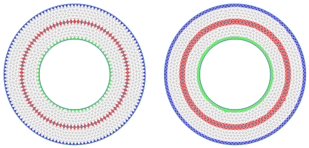

# Example 5 - Finding boundary triangles

This example will show how to find triangles at the boundary of a mesh:



This example uses code from [Example 2](Example_2.md).

```
namespace Examples
{
    using System;
    using TriangleNet;
    using TriangleNet.Geometry;
    using TriangleNet.Meshing;
    using TriangleNet.Meshing.Iterators;
    using TriangleNet.Rendering.GDI;
    using TriangleNet.Smoothing;

    public static class Example5
    {
        public static void FindBoundary()
        {
            var mesh = CreateMesh();

            FindBoundary1(mesh);
            ImageRenderer.Save(mesh, "boundary-1.png", 250, true, false);

            foreach (var triangle in mesh.Triangles)
            {
                triangle.Label = 0;
            }

            FindBoundary2(mesh);
            ImageRenderer.Save(mesh, "boundary-2.png", 250, true, false);
        }

        /// <summary>
        /// Find boundary triangles using segments.
        /// </summary>
        private static void FindBoundary1(Mesh mesh)
        {
            foreach (var s in mesh.Segments)
            {
                int label = s.Label;

                // Get both adjacent triangles.
                var a = s.GetTriangle(0);
                var b = s.GetTriangle(1);

                if (a != null) a.Label = label;
                if (b != null) b.Label = label;
            }
        }

        /// <summary>
        /// Find boundary triangles using vertices.
        /// </summary>
        private static void FindBoundary2(Mesh mesh)
        {
            var circulator = new VertexCirculator(mesh);

            foreach (var vertex in mesh.Vertices)
            {
                int label = vertex.Label;

                if (label > 0)
                {
                    var star = circulator.EnumerateTriangles(vertex);

                    // WARNING: triangles will be processed multiple times.
                    foreach (var triangle in star)
                    {
                        triangle.Label = label;
                    }
                }
            }
        }

        private static Mesh CreateMesh()
        {
            // Generate the input geometry.
            var polygon = Example2.CreateRingPolygon(4.0, 0.2);

            // Since we want to do CVT smoothing, ensure that the mesh
            // is conforming Delaunay.
            var options = new ConstraintOptions() { ConformingDelaunay = true };

            var quality = new QualityOptions() { MinimumAngle = 25.0 };

            // Generate mesh.
            var mesh = (Mesh)polygon.Triangulate(options, quality);

            // The boundary segments have a length of 0.2, so we set a
            // maximum area constraint assuming equilateral triangles.
            quality.MaximumArea = (Math.Sqrt(3) / 4 * 0.2 * 0.2) * 1.45;

            mesh.Refine(quality);

            // Do some smoothing.
            (new SimpleSmoother()).Smooth(mesh, 100);

            return mesh;
        }
    }
}
```
