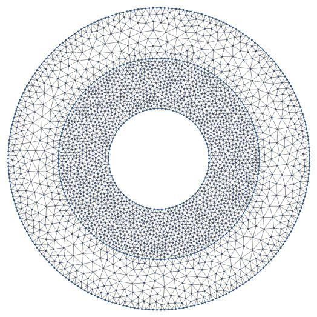

# Refining regions

This example will show how to refine a mesh in a specific region. The following code assumes to be run from the Mesh Explorer project, since it uses the `CircleWithHole` generator located in `MeshExplorer.Generators`:

```
// Generate the input geometry
var geometry = (new CircleWithHole()).Generate(100, 8, 0);

// Generate quality mesh
var mesh = new Mesh();
mesh.Behavior.MinAngle = 30;
mesh.Triangulate(geometry);
mesh.Smooth();
mesh.Refine();

// Calculate mesh quality
var quality = new QualityMeasure();
quality.Update(mesh);

// Use the minimum triangle area for region refinement
double area = 1.75 * quality.AreaMinimum;

foreach (var t in mesh.Triangles)
{
    // Set area constraint for all triangles in region 1
    if (t.Region == 1) t.Area = area;
}

// Use per triangle area constraint for next refinement
mesh.Behavior.VarArea = true;
mesh.Behavior.MinAngle = 25;
mesh.Refine();
mesh.Smooth();
```

## Resulting mesh


